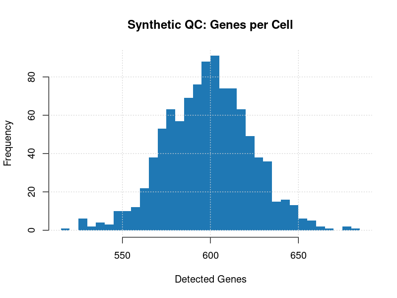
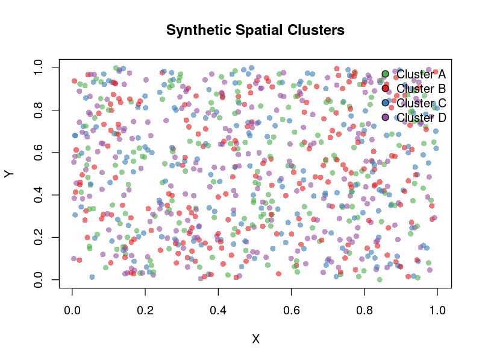

# Giotto Spatial Transcriptomics Pipeline

Container-ready R workflow for ingesting Xenium spatial transcriptomics outputs, applying the Giotto analysis toolkit, and exporting reproducible QC artefacts, embeddings, and clustering summaries. The project mirrors the documentation style of other NIDAP Community CAF tools (for example, multi-gene-correlations) while the container build remains in progress.

## Example Outputs

- Synthetic QC histogram: 
- Synthetic spatial scatter: 

These lightweight illustrations preview the types of PNG deliverables written under `results/<run_id>/plots/` and `results/<run_id>/qc/` when running against Xenium datasets.

## Features

- Xenium ingest (`cell_feature_matrix.h5` + cells metadata) with automatic project ID detection
- Giotto-based normalization, dimensionality reduction, and Leiden clustering
- Structured outputs: cluster tables, spatial and UMAP plots, QC metrics, Giotto object, run metadata
- Container-as-a-Function execution contract (single entrypoint, explicit inputs/outputs)
- `renv.lock` for reproducible local or containerized restores

## Current Status

- Local-first execution is working via `scripts/run_all.R`
- Dockerfile scaffolding exists for off-cluster builds; container image has not been published yet
- `results/` is ignored by git; generate outputs locally or inside the container and archive externally as needed

## Quick Start (Local)

```bash
module load R/4.4.3
cd /path/to/giotto-st-pipeline
Rscript -e 'renv::restore(prompt = FALSE)'
Rscript scripts/run_all.R \
	--input_format xenium \
	--input_dir /data/xenium/output-XETG00202__0024834_Right__SCAF04264_Right_R1__20240912__162834 \
	--output_dir /data/results/xenium_r1 \
	--project_id XETG00202_R1
```

Review `/data/results/xenium_r1/metadata/run_parameters.json` for a structured summary of the run configuration. Adjust `--cores`, `--python_path`, or `--seed` as needed for your environment.

## Inputs

| Flag | Description |
| --- | --- |
| `--input_dir` | Xenium output directory containing `cell_feature_matrix.h5` and `cells.csv[.gz]`. |
| `--project_id` | Optional short identifier used to prefix plot/table artefacts; defaults to folder name. |
| `--python_path` | Optional Python binary for Giotto (e.g., `~/.local/share/r-miniconda/envs/giotto_env/bin/python`). |
| `--cores` | Number of CPU cores to dedicate to Giotto (default: 4). |
| `--seed` | Random seed applied before dimensionality reduction and clustering (default: 1). |

Additional formats (Visium, generic matrices) are stubbed and will be enabled once ingest helpers are implemented.

## Outputs

```
results/<project_id>/
├── metadata/
│   ├── run_parameters.json
│   └── session_info.txt
├── objects/
│   └── <project_id>_giotto_object.rds
├── qc/
│   ├── <project_id>_qc_metrics.csv
│   ├── <project_id>_qc_summary.txt
│   ├── <project_id>_nr_genes_hist.png
│   ├── <project_id>_total_expr_hist.png
│   └── <project_id>_genes_vs_expr.png
├── plots/
│   ├── <project_id>_spatial.png
│   └── <project_id>_umap.png
└── tables/
		└── clusters.csv
```

When executed inside the forthcoming container the same directory layout will be written under the mounted `--output_dir`.

## Container Build (off-cluster)

1. Restore the R environment locally (`renv::restore()`)
2. Build the image on a workstation with Docker:

```bash
./container/build.sh giotto-st-pipeline:dev
```

3. Optionally export to a tarball and convert to `.sif` for Apptainer/Singularity:

```bash
docker save giotto-st-pipeline:dev -o giotto-st-pipeline.tar
singularity build giotto-st-pipeline.sif docker-archive://giotto-st-pipeline.tar
```

HPC environments without Docker should rely on pre-built `.sif` artefacts generated off-cluster.

## Reproducible Environment

- `renv.lock` pins CRAN, Bioconductor, and GitHub package revisions (Giotto and spatstat suites)
- `.Rprofile` auto-activates renv for interactive sessions (`source("renv/activate.R")`)
- System dependencies required for compiled R packages are documented in `container/Dockerfile`

Use `renv::status()` before committing dependency changes to ensure the lockfile stays current.

## Roadmap

- Finalize container build and publish GHCR image
- Expand ingest to cover Visium/Matrix layouts
- Automate lightweight tests under `tests/`
- Document example configs under `configs/`
