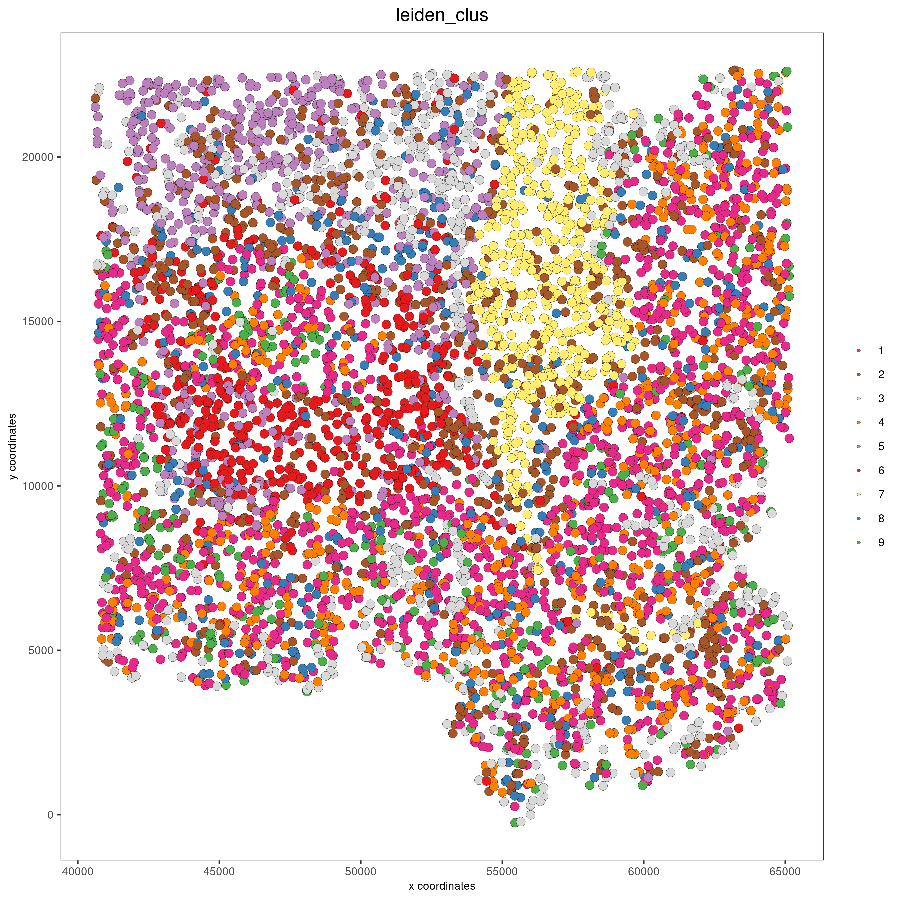
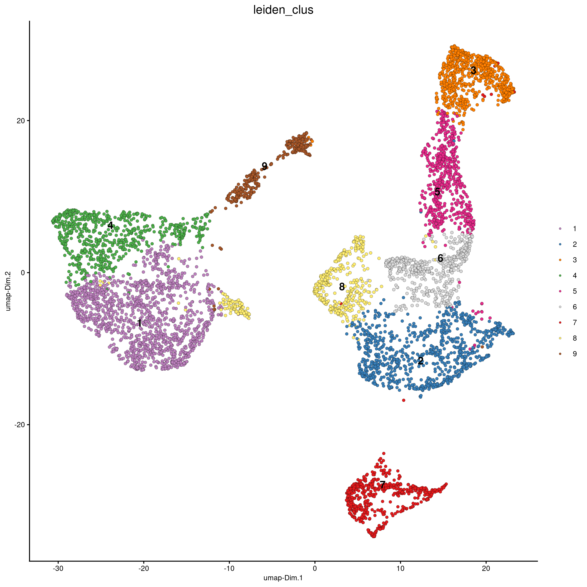
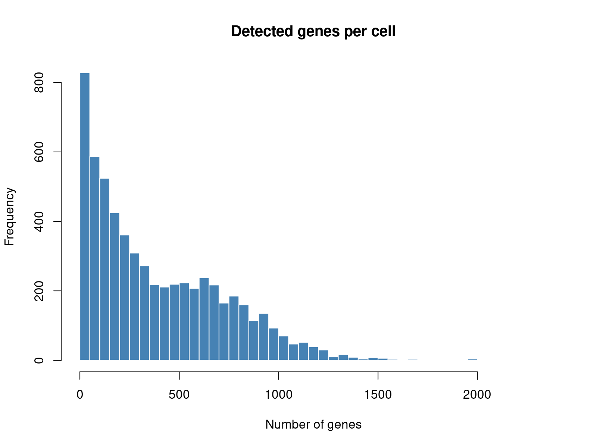
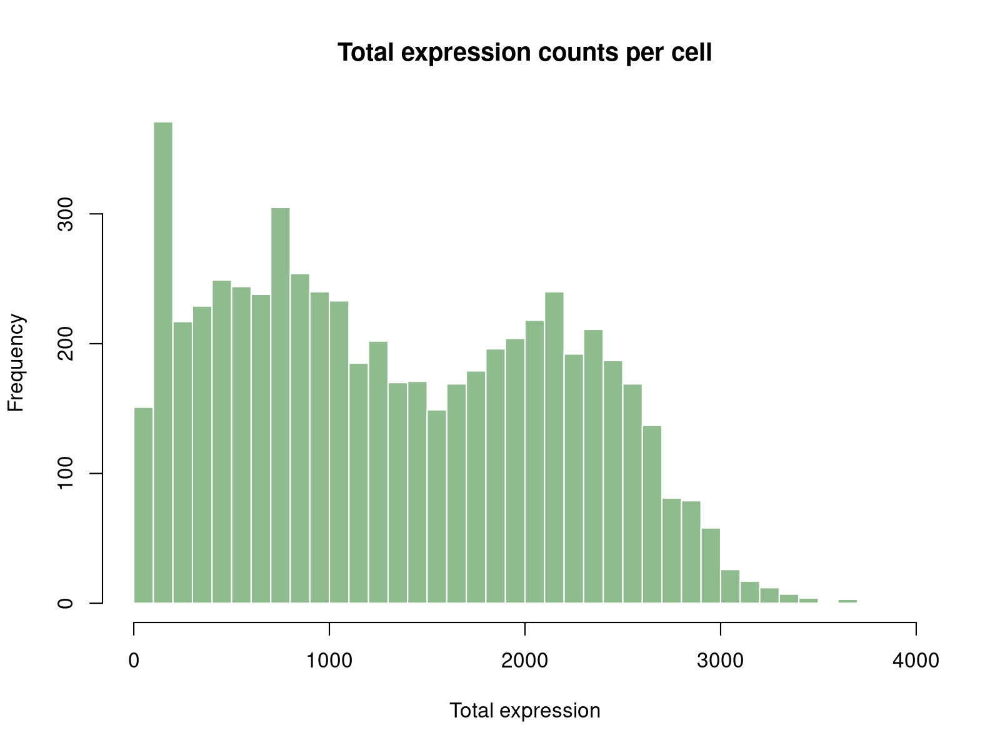
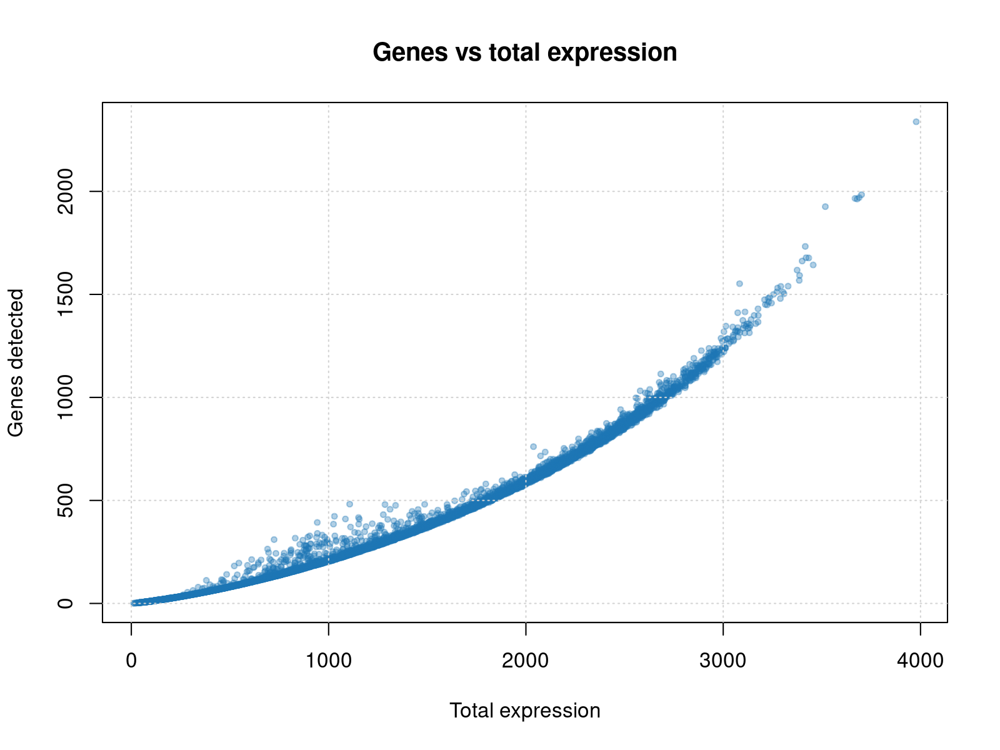

# Giotto Spatial Transcriptomics Pipeline

Container-ready R workflow for ingesting Xenium and Visium/Visium HD spatial transcriptomics outputs, applying the Giotto analysis toolkit, and exporting reproducible QC artefacts, embeddings, and clustering summaries. The project mirrors the documentation style of other NIDAP Community CAF tools (for example, multi-gene-correlations) while the container build remains in progress.

## Example Outputs

Visium HD (square_008um, `--max_cells 6000`):







These figures are exported automatically beneath `results/<run_id>/plots/` and `results/<run_id>/qc/` for every pipeline run.

## Features

- Xenium ingest (`cell_feature_matrix.h5` + cells metadata) with automatic project ID detection
- Visium + Visium HD ingest (Spaceranger outs with filtered/raw feature matrix + spatial metadata)
- Automatically extracts Spaceranger `*spatial*.zip` bundles when spatial assets are archived
- AnnData (`.h5ad`) ingest with automatic discovery of expression matrices (X, layers, raw) and spatial coordinates (obs columns or `obsm['spatial']`)
- Optional QC filters (e.g., `--min_genes_per_cell`, `--min_total_expr_per_cell`, `--max_mito_pct` with configurable prefixes)
- Optional `--max_cells` downsampling to trim oversized datasets before Giotto normalization
- Giotto-based normalization, dimensionality reduction, and Leiden clustering
- Structured outputs: cluster tables, spatial and UMAP plots, QC metrics, per-filter QC summary, Giotto object, run metadata
- Container-as-a-Function execution contract (single entrypoint, explicit inputs/outputs)
- `renv.lock` for reproducible local or containerized restores

## Current Status

- Local-first execution is working via `scripts/run_all.R`
- Dockerfile scaffolding exists for off-cluster builds; container image has not been published yet
- `results/` is ignored by git; generate outputs locally or inside the container and archive externally as needed

## Quick Start (Local)

```bash
module load R/4.4.3
cd /path/to/giotto-st-pipeline
Rscript -e 'renv::restore(prompt = FALSE)'
Rscript scripts/run_all.R \
	--input_format xenium \
	--input_dir /data/xenium/output-XETG00202__0024834_Right__SCAF04264_Right_R1__20240912__162834 \
	--output_dir /data/results/xenium_r1 \
	--project_id XETG00202_R1

# Visium / Visium HD (Spaceranger outs directory)
Rscript scripts/run_all.R \
	--input_format visium \
	--input_dir /data/vishd/sample123/outs \
	--output_dir /data/results/sample123 \
	--project_id sample123

# AnnData (.h5ad)
Rscript scripts/run_all.R \
	--input_format h5ad \
	--input_path /data/visium/sample123.h5ad \
	--output_dir /data/results/sample123_h5ad \
	--project_id sample123_h5ad \
	--python_path ~/.local/share/r-miniconda/envs/giotto_env/bin/python
```

Review `/data/results/xenium_r1/metadata/run_parameters.json` for a structured summary of the run configuration. Adjust `--cores`, `--python_path`, or `--seed` as needed for your environment.

## Inputs

| Flag | Description |
| --- | --- |
| `--input_format` | Choose `xenium`, `visium`, or `h5ad` explicitly (default `auto` infers from directory structure or file extension). |
| `--input_dir` | Standardized ST input directory (Xenium `cell_feature_matrix.h5` + cells CSV; Visium/Visium HD Spaceranger `outs/`). |
| `--input_path` | Direct path to a single-file input (currently `.h5ad`). Ignored for directory-based formats. |
| `--max_cells` | Randomly subsample cells/spots before analysis (helpful for Visium HD on memory-constrained nodes). |
| `--min_genes_per_cell` | Drop cells whose detected genes fall below this integer threshold prior to normalization. |
| `--min_total_expr_per_cell` | Drop cells whose total expression counts fall below this integer threshold. |
| `--max_mito_pct` | Drop cells whose mitochondrial expression fraction (percentage) exceeds this value. |
| `--mito_gene_prefixes` | Comma-separated gene symbol prefixes treated as mitochondrial (default `MT-`; pass `none` to disable). |
| `--project_id` | Optional short identifier used to prefix plot/table artefacts; defaults to folder name. |
| `--python_path` | Optional Python binary for Giotto (e.g., `~/.local/share/r-miniconda/envs/giotto_env/bin/python`). |
| `--cores` | Number of CPU cores to dedicate to Giotto (default: 4). |
| `--seed` | Random seed applied before dimensionality reduction and clustering (default: 1). |
| `--dry_run` | Validate inputs (including `.h5ad` content) and exit before running the Giotto workflow. |

When ingesting Visium HD outputs, install the R `arrow` package via `renv::install('arrow')` (or provide a CSV tissue positions file) so parquet spatial metadata can be parsed. For very high-resolution Visium HD runs (hundreds of thousands of spots), use `--max_cells` (e.g., `--max_cells 4000`) or schedule the job on a compute node to avoid login-node OOM kills. Matrix-format ingest remains TODO.

Visium runs generated by Spaceranger sometimes package spatial assets inside `*spatial*.zip`; the pipeline now unpacks these archives automatically into a temporary directory during ingest.

AnnData ingest relies on Python packages `anndata` (≥0.7) and `scipy` being available to the Giotto reticulate environment. Supply `--python_path` if Giotto should use a specific virtual environment.

Mitochondrial filtering treats prefixes case-insensitively; the default of `MT-` matches human gene symbols. Provide multiple prefixes separated by commas (e.g., `MT-,nd`), or set `--mito_gene_prefixes none` to skip mitochondrial checks entirely.

## Outputs

```
results/<project_id>/
├── metadata/
│   ├── run_parameters.json
│   ├── session_info.txt
│   └── <project_id>_filter_summary.csv
├── objects/
│   └── <project_id>_giotto_object.rds
├── qc/
│   ├── <project_id>_qc_metrics.csv
│   ├── <project_id>_qc_summary.txt
│   ├── <project_id>_nr_genes_hist.png
│   ├── <project_id>_total_expr_hist.png
│   └── <project_id>_genes_vs_expr.png
├── plots/
│   ├── <project_id>_spatial.png
│   └── <project_id>_umap.png
└── tables/
		└── clusters.csv
```

When executed inside the forthcoming container the same directory layout will be written under the mounted `--output_dir`.

## Container Build (off-cluster)

1. Restore the R environment locally (`renv::restore()`)
2. Build the image on a workstation with Docker:

```bash
./container/build.sh giotto-st-pipeline:dev
```

3. Optionally export to a tarball and convert to `.sif` for Apptainer/Singularity:

```bash
docker save giotto-st-pipeline:dev -o giotto-st-pipeline.tar
singularity build giotto-st-pipeline.sif docker-archive://giotto-st-pipeline.tar
```

HPC environments without Docker should rely on pre-built `.sif` artefacts generated off-cluster.

## Reproducible Environment

- `renv.lock` pins CRAN, Bioconductor, and GitHub package revisions (Giotto and spatstat suites)
- `.Rprofile` auto-activates renv for interactive sessions (`source("renv/activate.R")`)
- System dependencies required for compiled R packages are documented in `container/Dockerfile`

Use `renv::status()` before committing dependency changes to ensure the lockfile stays current.

## Roadmap

- Finalize container build and publish GHCR image
- Add matrix-format ingest helper
- Automate lightweight tests under `tests/`
- Document example configs under `configs/`
