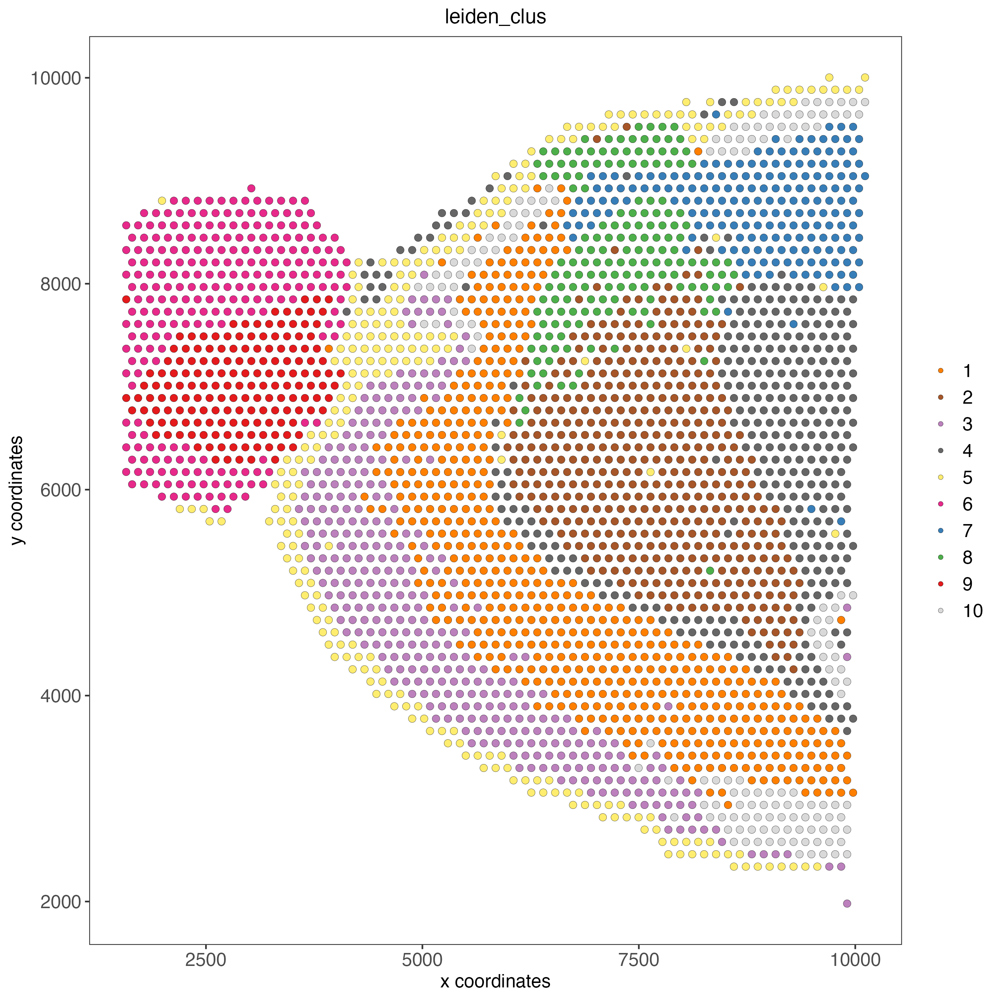
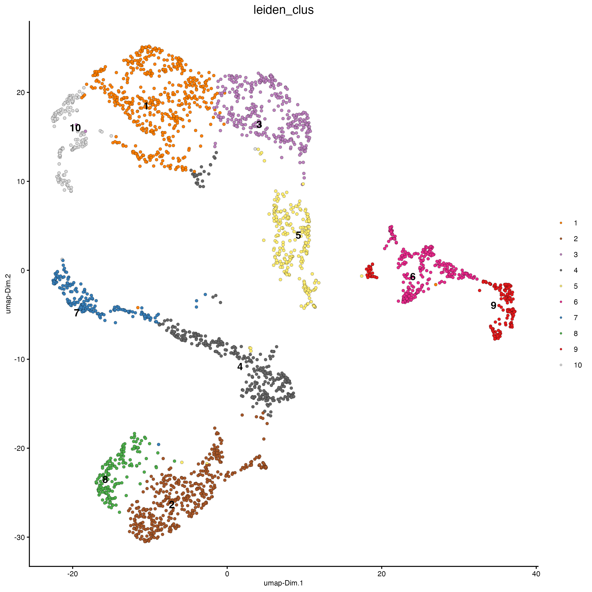
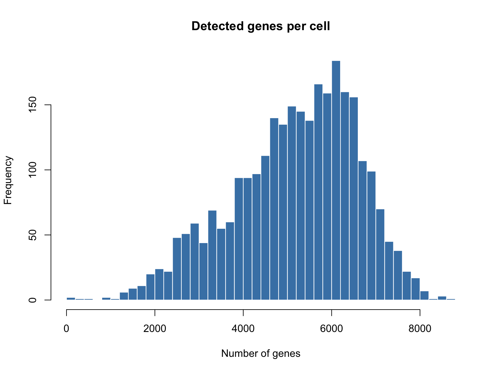
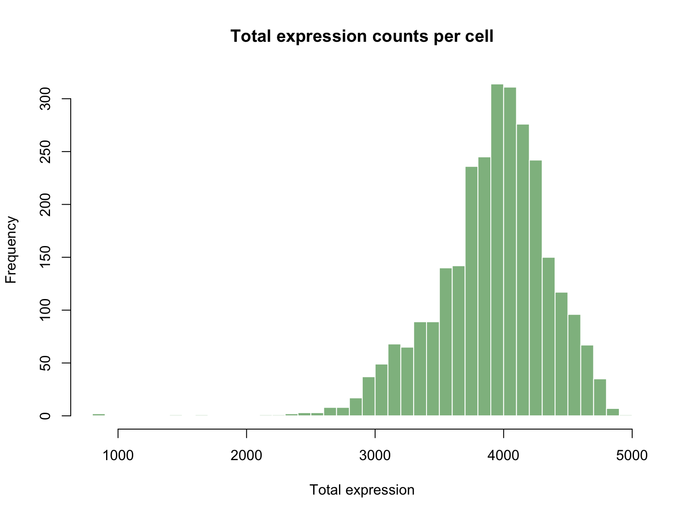
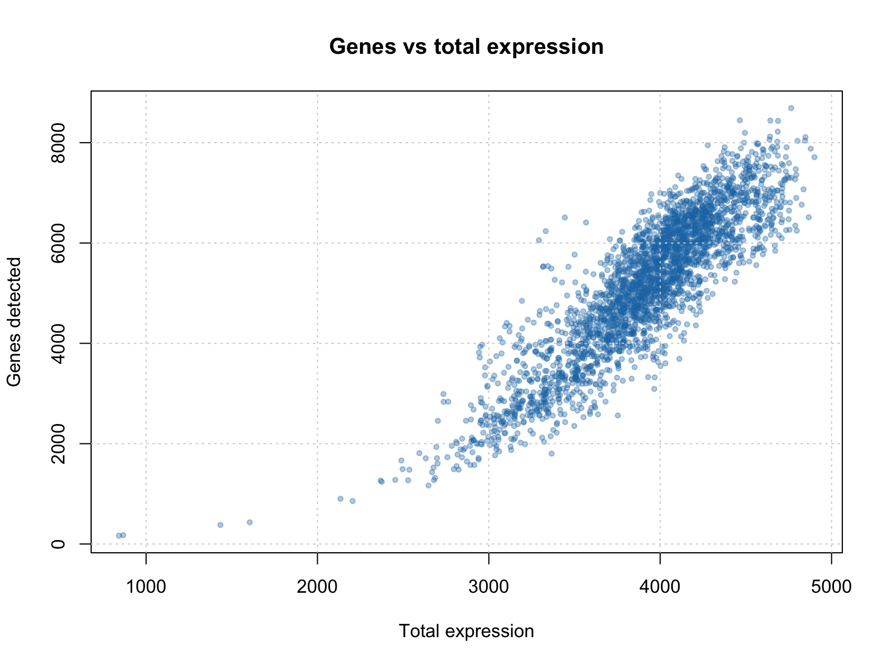

# Giotto Spatial Transcriptomics Pipeline

R workflow for first-pass spatial transcriptomics analysis with Giotto. It
ingests Xenium, Visium/Visium HD, and AnnData inputs, then exports QC plots,
embeddings, cluster tables, Giotto objects, and publication-oriented run
metadata.

Start with the run mode that best matches how you work:

1. Local command-line R from a cloned repo
2. R Markdown notebook
3. Singularity/Apptainer on HPC
4. Docker on a workstation

All modes call the same entrypoint, `scripts/run_all.R`, and can use the same
YAML/JSON config files. For source development, rebuilds, dependency
maintenance, and Giotto version notes, see
[docs/developer_readme.md](docs/developer_readme.md).

## When To Use This Workflow

Use this workflow for standardized screening across spatial transcriptomics
datasets. It is meant to answer practical first-pass questions: does the dataset
ingest cleanly, what do the QC distributions look like, are there clear UMAP or
spatial cluster patterns, and which samples need deeper follow-up?

This workflow is not intended to replace exploratory Giotto analysis. For custom
plotting, project-specific interpretation, method development, image-aware
review, or newer Giotto Suite features, working directly in Giotto or Giotto
Suite is usually the better next step.

## Choose A Run Mode

### 1. Local Command-Line R

Use this path if you are comfortable with R and want to run directly from a
source checkout using the pinned `renv.lock` environment.

```bash
git clone https://github.com/NIDAP-Community/giotto-st-pipeline.git
cd giotto-st-pipeline

# For publication, pin to a specific release before restoring packages:
# git checkout v0.1.0

Rscript -e 'install.packages("renv", repos = "https://cloud.r-project.org")'
Rscript -e 'renv::restore(prompt = FALSE)'

export R_LIBS_USER="$(Rscript -e 'source("renv/activate.R"); cat(.libPaths()[1])')"
cp configs/visium_template.yaml configs/my_visium_run.yaml
```

The `export` makes the renv library available for the rest of your shell
session, so subsequent commands don't need to repeat it.

Edit the copied config before running. For Xenium, Visium, or Visium HD, set
`input_dir` to your data directory. For regular Visium, use the Spaceranger
`outs/` directory. For Visium HD, use the selected binned output directory, for
example `outs/binned_outputs/square_008um`. For h5ad, set `input_path` to the
`.h5ad` file. Set
`output_dir` to where results should be written. The pipeline reads data in
place; your input files stay where they are.

- [configs/xenium_template.yaml](configs/xenium_template.yaml)
- [configs/visium_template.yaml](configs/visium_template.yaml)
- [configs/h5ad_template.yaml](configs/h5ad_template.yaml)

Example config (Visium or Visium HD):

```yaml
# What kind of input data (visium, xenium, h5ad, or auto to detect)
input_format: visium

# Where your data lives. For Visium HD, use a chosen bin directory such as
# /home/user/data/spaceranger/outs/binned_outputs/square_008um.
input_dir: /home/user/data/spaceranger/outs

# Where results will be written (created automatically if it doesn't exist)
output_dir: results/my_sample

# Short name used in output filenames
project_id: my_sample

# Analysis parameters (all optional — sensible defaults are used if omitted)
cores: 4
cluster_resolution: 0.4
max_cells: 6000          # downsample large datasets; use "none" to use all cells
```

See [configs/README.md](configs/README.md) for the full parameter reference.

Validate the config before a long run:

```bash
Rscript scripts/validate_config.R configs/my_visium_run.yaml
```

Then run the pipeline:

```bash
Rscript scripts/run_all.R --config configs/my_visium_run.yaml
```

CLI flags can override a saved config value:

```bash
Rscript scripts/run_all.R \
	--config configs/my_visium_run.yaml \
	--cluster_resolution 0.8
```

To see all available flags:

```bash
Rscript scripts/run_all.R --help
```

### 2. R Markdown Notebook

Use the notebook path when you want a literate record of the analysis command,
outputs, and publication provenance.

```bash
Rscript -e 'rmarkdown::render("examples/run_pipeline.Rmd", params = list(config = "configs/my_visium_run.yaml"))'
```

The example notebook calls the same `scripts/run_all.R --config ...` command and
prints the paths to the run metadata, QC tables, cluster table, and plots.

### 3. Singularity Or Apptainer

Use this path on HPC systems where Docker is not available.

```bash
module load singularity

IMAGE_REPO="ghcr.io/nidap-community/giotto-st-pipeline"

# For testing, use "latest". For publication, use a release version:
IMAGE_TAG="0.1.0"

singularity pull giotto-st-pipeline.sif "docker://${IMAGE_REPO}:${IMAGE_TAG}"
```

Create a container-facing config where paths use `/data` and `/output`:

```bash
cp configs/visium_template.yaml configs/my_visium_container.yaml
```

Edit `configs/my_visium_container.yaml` so the key paths look like this:

```yaml
input_format: visium
input_dir: /data
output_dir: /output/visium_sample
project_id: visium_sample
```

Run the pipeline using the helper script. Set `DATA_DIR` to your input data and
`OUTPUT_DIR` to where results should be written. For Visium HD, `DATA_DIR`
should be the selected binned output directory, such as
`/path/to/spaceranger/outs/binned_outputs/square_008um`.

```bash
DATA_DIR=/path/to/spaceranger/outs \
OUTPUT_DIR=/path/to/results \
EXTRA_BINDS="$PWD/configs:/configs:ro" \
./container/run_apptainer.sh giotto-st-pipeline.sif \
	--config /configs/my_visium_container.yaml
```

The helper works with both `singularity` and `apptainer`, mounts your data
read-only, and records container provenance automatically.

To see all available flags from a container:

```bash
./container/run_apptainer.sh giotto-st-pipeline.sif --help
```

### 4. Docker

Use Docker if you already work with Docker locally or are maintaining the
container image.

```bash
IMAGE_REPO="ghcr.io/nidap-community/giotto-st-pipeline"

# For testing, use "latest". For publication, use a release version:
IMAGE_TAG="0.1.0"

docker pull "${IMAGE_REPO}:${IMAGE_TAG}"

cp configs/visium_template.yaml configs/my_visium_container.yaml
# Edit the copied config so input_dir is /data and output_dir is /output/...
# For Visium HD, bind one square_*um binned output directory to /data.

docker run --rm \
	-v /path/to/spaceranger/outs:/data:ro \
	-v "$PWD/results":/output \
	-v "$PWD/configs":/configs:ro \
	"${IMAGE_REPO}:${IMAGE_TAG}" \
	--config /configs/my_visium_container.yaml
```

Check the version and source commit baked into the image:

```bash
docker inspect "${IMAGE_REPO}:${IMAGE_TAG}" \
	--format 'version={{ index .Config.Labels "org.opencontainers.image.version" }} commit={{ index .Config.Labels "org.opencontainers.image.revision" }}'
```

## Record This For Publication

Every run writes these files under `results/<project_id>/metadata/`:

- `provenance.json`
- `run_parameters.json`
- `session_info.txt`

Archive those files with the outputs used in a manuscript or report.

### How provenance works

You don't need to do anything extra. Every run automatically records:

- Which version of the pipeline was used
- Which git commit or container image it came from
- The R version, platform, and timestamp
- Which packages were installed (via `renv.lock` hash)
- Container details (image tag, runtime, SIF checksum) when running in a container

If any of this can't be determined (e.g., running from a downloaded zip without
git), the pipeline warns at startup so you know something is missing.

To check your version at any time:

```bash
Rscript scripts/run_all.R --version
```

## Supported Inputs

- Xenium output directories with `cell_feature_matrix.h5` and cells metadata
- Visium and Visium HD Spaceranger `outs/` directories
- AnnData `.h5ad` files

The published container image restores the full locked runtime, including
optional packages such as `arrow`. For smaller local debugging builds,
maintainers may publish or build an explicit lean variant with reduced Visium
parquet support.

## What The Pipeline Produces

- QC metrics, filter summaries, and QC plots
- UMAP and spatial cluster plots
- Leiden cluster assignments
- Restartable Giotto object checkpoints after ingest, QC, and analysis stages
- A final exported Giotto object
- `metadata/provenance.json`, `metadata/run_parameters.json`, and
  `metadata/session_info.txt`

## Example Outputs

Visium mouse brain example (`--max_cells 6000`):







These figures are exported automatically beneath `results/<project_id>/plots/`
and `results/<project_id>/qc/` for every pipeline run.

## Common Options

| Flag | Description |
| --- | --- |
| `--config` | YAML or JSON config file. CLI flags override config values. |
| `--stage` | Workflow stage: `all`, `validate`, `ingest`, `qc`, `analyze`, or `export`. Default is `all`. |
| `--input_format` | Choose `xenium`, `visium`, or `h5ad`; default `auto` infers from directory structure or file extension. |
| `--input_dir` | Input directory for Xenium or Visium/Visium HD runs. For Visium HD, use one selected `outs/binned_outputs/square_*um` directory. |
| `--input_path` | Direct path to a single-file input, currently `.h5ad`. |
| `--input_object` | Existing Giotto object RDS used as input for restartable `qc`, `analyze`, or `export` stages. |
| `--output_dir` | Directory where results are written. |
| `--project_id` | Short identifier used to prefix plot and table artefacts. Defaults to folder name. |
| `--max_cells` | Randomly subsample cells/spots before analysis; useful for large Visium HD runs. |
| `--min_genes_per_cell` | Drop cells whose detected genes fall below this threshold. |
| `--min_total_expr_per_cell` | Drop cells whose total expression counts fall below this threshold. |
| `--max_mito_pct` | Drop cells whose mitochondrial expression fraction exceeds this percentage. |
| `--mito_gene_prefixes` | Comma-separated mitochondrial gene prefixes; default is `MT-`; pass `none` to disable. |
| `--pca_dims` | Maximum number of PCA dimensions used for UMAP and clustering. Default is `10`. |
| `--neighbor_k` | Nearest-neighbor graph k before clustering. Default is `20`; capped at cells - 1. |
| `--cluster_resolution` | Leiden clustering resolution. Higher values usually produce more clusters. |
| `--spatial_point_size` | Dot size for the exported spatial map. |
| `--umap_point_size` | Dot size for the exported UMAP plot. |
| `--spatial_legend_text` | Legend text size for the exported spatial map. |
| `--spatial_legend_symbol_size` | Legend symbol scale factor for the exported spatial map. |
| `--spatial_axis_text` | Axis tick text size for the exported spatial map. |
| `--spatial_axis_title` | Axis title size for the exported spatial map. |
| `--python_path` | Optional Python binary for Giotto and AnnData support. |
| `--cores` | Number of CPU cores to dedicate to Giotto. Default is `4`. |
| `--seed` | Random seed applied before dimensionality reduction and clustering. Default is `1`. |
| `--dry_run` | Validate inputs and exit before running the workflow. |
| `--verbose` | Enable more detailed logging. |
| `--version` | Print the pipeline version and exit. |

## Iterating On Results

First-pass clustering may be too coarse or too granular. Re-run with adjusted
`--cluster_resolution`, `--pca_dims`, or `--neighbor_k` to tune the preliminary
view before deciding whether a dataset needs deeper interactive analysis.

To rerun only plotting and table export from an existing analyzed object, use
`--stage export` with `--input_object`. This is useful when adjusting plot
settings such as `--spatial_point_size`, legend size, or axis text without
repeating ingest, QC, and clustering.

```bash
R_LIBS_USER="$PROJECT_R_LIB" Rscript scripts/run_all.R \
	--stage export \
	--input_object results/visium_sample/objects/visium_sample_analyzed_giotto.rds \
	--output_dir results/visium_sample \
	--project_id visium_sample \
	--spatial_point_size 2.25 \
	--spatial_legend_text 12 \
	--spatial_axis_title 12
```

## Output Layout

```text
results/<project_id>/
├── metadata/
│   ├── provenance.json
│   ├── run_parameters.json
│   ├── session_info.txt
│   └── <project_id>_filter_summary.csv
├── objects/
│   ├── <project_id>_ingested_giotto.rds
│   ├── <project_id>_qc_giotto.rds
│   ├── <project_id>_analyzed_giotto.rds
│   └── <project_id>_giotto_object.rds
├── qc/
│   ├── <project_id>_qc_metrics.csv
│   ├── <project_id>_qc_summary.txt
│   ├── <project_id>_nr_genes_hist.png
│   ├── <project_id>_total_expr_hist.png
│   └── <project_id>_genes_vs_expr.png
├── plots/
│   ├── <project_id>_spatial.png
│   └── <project_id>_umap.png
└── tables/
    └── clusters.csv
```

## Notes And Limitations

- Visium runs generated by Spaceranger sometimes package spatial assets inside
  `*spatial*.zip`; the pipeline extracts these archives automatically during
  ingest.
- AnnData ingest relies on Python packages `anndata` and `scipy` being
  available to the Giotto reticulate environment.
- For very high-resolution Visium HD runs, use `--max_cells` or schedule the
  job on a compute node to avoid memory failures on login nodes.
- Matrix-format ingest remains TODO.

## Additional Documentation

- [QUICKSTART.md](QUICKSTART.md): concise runnable examples
- [configs/README.md](configs/README.md): config file templates and usage
- [container/README.md](container/README.md): container build, run, and publication details
- [docs/developer_readme.md](docs/developer_readme.md): developer and maintainer notes
